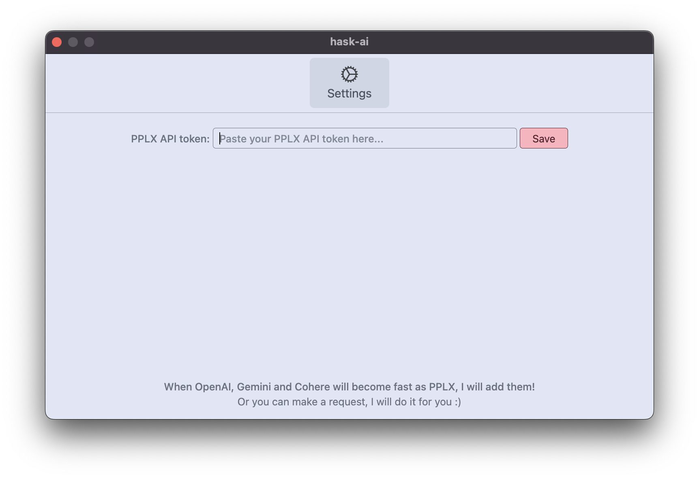

# Hask AI

Hask AI is a customizable, open-source application that allows users to quickly search the internet and receive instant results. It offers a seamless experience, accessible through a keyboard shortcut, and empowers users to leverage the power of PPLX API.


## Features

- **Instant Search**: Quickly search the internet and receive instant results.
- **Customizable Shortcut**: Access the application conveniently through a customizable keyboard shortcut (default: Option+X). (WIP)
- **PPLX API Integration**: Communicate with the server using PPLX API for seamless interaction.
- **Other model**: To be requested, feel free to request any model you want to use.
- **Dark Mode**: Switch between light and dark mode for a comfortable viewing experience. (WIP)
- **Open Source**: Free and open-source software, allowing for community contribution and customization.

## Release
It is available for Windows, Mac, and Linux.

Just configure the pplx api token and you are good to go.


## Installation and Usage
1. Clone the repository:

```bash
git clone https://github.com/bm777/hask-ai.git
npm i
npm run dev

# or build for your platform
npm run build
```
2. Usage: 
It is the same scenario in dev or build mode.
- Open the app and use the keyboard shortcut (default: Option+X) to open the application.


- Configure the pplx api token.


- Perform a search by typing in your query and pressing Enter.
- Enjoy instant results from the internet!


## Contributing
Contributions are welcome! If you have any ideas for new features or improvements, feel free to open an issue or submit a pull request.